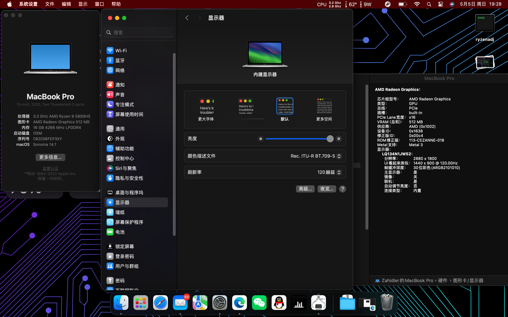
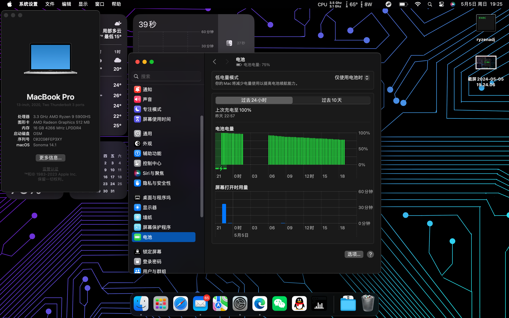

[English](README_en.md)

# ROG X13 Flow（幻13）2021款

## 说明

**本EFI仅在Sonoma 14.1中测试使用，其他版本MacOS请自行测试调试**

**机型信息已删除，请自行生成更换**

---
## 截图

---
### 使用情况

---
- &#9745; 核显
- &#9745; WIFI
- &#9745; 触控板
- &#9744; 触屏
- &#9745; 睡眠
- &#9744; 重力感应&自动旋转屏幕
- &#9744; 平板模式
- &#9745; USB-C显示输出
- &#9745; HDMI显示输出
- &#9745; 3.5mm耳机接口
- &#9745; USB接口
- &#9745; 笔记本屏幕120Hz刷新率
- &#9744; 硬件加速&硬件编解码
- &#9744; 隔空投送
- &#9745; 音频输出&键盘音量调节按键
- &#9744; 键盘亮度调节按键/Fn+F区按键功能
- &#9745; 摄像头

### 存在的问题

1.偶尔卡住，主要表现在某些需要硬件加速的情况（需要硬件加速的图形区域显示红色）

2.硬件编解码暂时还有问题，具体请移至NootedRed页面查看最新进展

3.无法使用隔空投送等功能（Sonoma）

4.键盘fn亮度调节按钮无法使用

5.触屏无法使用，更换voodoo驱动或许可以解决

### 配置

---
部件|型号|是否支持
:-|:-|:-|
CPU|AMD Ryzen 9 5900HS|支持
核显|AMD Radeon Vega 8 (AMD Cezanne)|支持
独立显卡|Nvidia RTX 3050Ti laptop|不支持
网卡|Intel AX200|支持
硬盘|WD SN530|支持

---
### 温度
可以通过关闭CPS(core performence boost）将温度控制在比较合适的范围，但是会损失一部分性能。可以通过UMAF在bios中关闭CPS，但是会影响其他系统比如windows的性能，建议是每次开机进系统后通过AMD Power Gadget关闭，至少目前是只能这样。

---
### 致谢

---
感谢NootedRed的开发者们，使得AMD核显黑苹果成为可能
>https://github.com/NootInc/NootedRed

