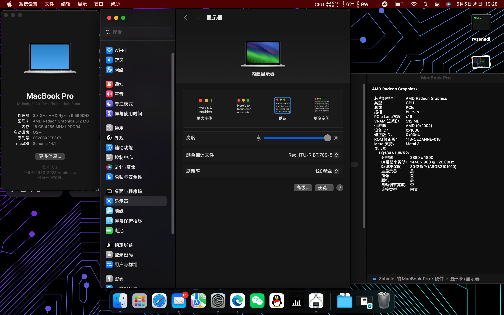
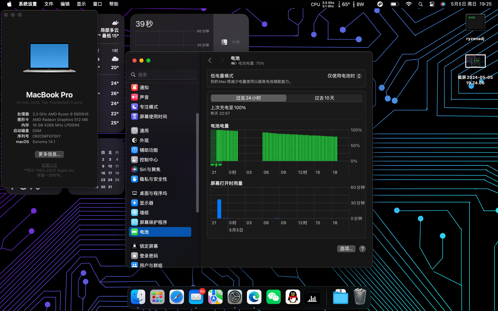

[简体中文](README.md)
# ROG X13 Flow 2021 Version

## Note

**This EFI bases on Sonoma 14.1, test yourself on other MacOS version**

**SMBIOS is deleted, you should generate your own**

---
## Screenshots

---
### What's work&not work

---
- &#9745; iGPU
- &#9745; WIFI
- &#9745; Touchpad
- &#9744; Touchscreen
- &#9745; Sleep
- &#9744; Gravity sensor & Screen auto rotation
- &#9744; Tablet mode
- &#9745; USB-C video output (via XGM port)
- &#9745; HDMI video output
- &#9745; 3.5mm headphone jack
- &#9745; USB
- &#9745; Laptop screen with 120Hz
- &#9744; Hardware acceleration & Hardware encode/decode
- &#9744; Airdrop
- &#9745; Audio & Volumn button on keyboard
- &#9744; Brightness adjust on keyboard/Fn+F区按键功能
- &#9745; Webcam

### Spec

---
Component|Model|Support
:-|:-|:-|
CPU|AMD Ryzen 9 5900HS|Supported
iGPU|AMD Radeon Vega 8 (AMD Cezanne)|Supported
dGPU|Nvidia RTX 3050Ti laptop|Unsupported
Network card|Intel AX200|Supported
Drive|WD SN530|Supported

---
### Thanks

---
Thanks to devs of NootedRed for making AMD iGPU hacknintosh possible
>https://github.com/NootInc/NootedRed
